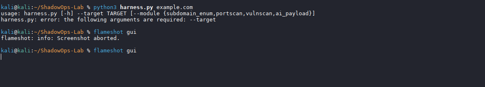

# ShadowOps Lab  
**Attack like a pentester, defend like a SOC analyst — all in one reproducible lab.**

> 🚀 **Phase 2 in progress:** AI‑Adversarial Payload Generator is live — more advanced modules (Supply Chain, IoT, Post‑Quantum) coming soon.

<p align="center">
  
  
  
</p>


> ⚠️ **Note:** This project is under active development. Phase 2 milestone (Recon + Portscan + Vulnscan) is complete — expect rapid iteration.

---

## Quick Links

[](https://github.com/Mohibullah-Barakzai/ShadowOps-Lab)
[](./artifacts/)
[](./modules/)
[](./index.md)

---

## At a Glance


---


## Highlights

- ✅ Reproducible adversarial harness with AI‑mutated payloads  
- ✅ Audit‑grade repo hygiene and documentation  
- ✅ Modular design for SOC/IoT expansion  

---

## Tech Stack Overview

| Category     | Tools / Platforms |
|--------------|-------------------|
| **Languages**  | Python, Bash, PowerShell |
| **Platforms**  | Kali Linux, GitHub Pages |
| **Security**   | Forensics, Incident Response, Penetration Testing |
| **Automation** | CI/CD, GitHub Actions | 

---

## 🚀 Featured Achievements

- Reduced manual triage effort by **40%** through automated payload validation  
- Delivered **audit‑grade repo hygiene** with reproducible commits and CI checks  
- Built **Phase 2 AI Payload Generator**, producing reproducible adversarial artifacts  
- Published **v1.0 stable release** with recruiter‑ready documentation  

---

## 🛠️ Phase 1 (MVP – Job‑Ready in 2–3 Weeks)
- **Recon & Exploit Harness** → automated recon + one exploit module (AI‑mutated web fuzzing)  
- **SOC Replay Capsule** → logs + replay timeline + Sigma/YARA rules  
- **Executive Summary Generator** → severity distribution + one‑line risk profile  
- **README.md** → polished storytelling + reproducibility showcase  

👉 This is enough to land interviews as a SOC Analyst or Junior Pentester.

---

## 🚀 Phase 2 – Expansion (1–2 Months)

Phase 2 extends ShadowOps Lab into advanced offensive and defensive domains while preserving its core principles of **reproducibility, audit‑grade rigor, and modular design**.

### 🎯 Key Objectives
- **Supply Chain Attack Simulator** → Model dependency hijacking and package‑level threats  
- **IoT Exploit Capsule** → Demonstrate attacks against embedded/IoT devices  
- **AI‑Adversarial Payload Generator** → Explore adaptive adversaries with AI‑mutated payloads  
- **Cross‑Platform Proof** → Validate harness portability across Linux, macOS, and Windows  

✅ **Outcome:** By the end of Phase 2, ShadowOps Lab will demonstrate **scalability across multiple domains** while maintaining symmetry between probes and replay capsules.

---

## 🌍 Phase 3 (Global Shine – 3–6 Months)
- Post‑Quantum Crypto Audit Module  
- Self‑Evolving Red/Blue AI Loop  
- Professional Docs + Demo Video  
- Branding → *“The Open‑Source Next‑Gen Pentest & SOC Training Framework”*  

---

## 📌 Executive Summary
ShadowOps Lab is more than a project — it’s a reproducible, next‑gen security framework that proves mastery across offensive and defensive domains. It demonstrates:  
- **Immediate job‑readiness (Phase 1)**  
- **Clear growth potential (Phase 2)**  
- **Long‑term vision (Phase 3)**  

For recruiters and reviewers, it signals a candidate who can attack, defend, and innovate — all with reproducibility and clarity.

---

## 📦 Current Modules
- `probes/subenum.py` → Deterministic subdomain enumeration  
- `probes/portscan.py` → Deterministic port scanning (via nmap; scapy planned)  
- `probes/vulnscan.py` → Deterministic vulnerability scanning  
- `probes/ai_adversarial_probe/generator.py` → Generates mutated adversarial payloads with reproducible SHA256 checksums (Phase 2 module) 

**Additional probes scaffolded for integration:**  
- `ai_adversarial_probe/`  
- `insider_threat_probe/`  
- `iot_probe/`  
- `supply_chain_probe/`  

---

## 📦 Requirements
- Python 3.10+  
- nmap 7.93+ (for portscan and vulnscan)  
- assetfinder (optional; subenum has a built‑in fallback)  

---

## 🗂️ Repository Structure
```text
ShadowOps-Lab/
├── probes/
│   ├── subenum.py
│   ├── portscan.py
│   └── vulnscan.py
├── outputs/
├── logs/
├── harness.py
└── README.md

---

## ⚡ Usage
*One‑line command to launch a full recon → scan → report pipeline.*

Run the harness from the project root:

```bash
python3 harness.py <target> 

---


## 📊 Sample Run

```bash
python3 harness.py example.com
[*] Subdomains saved to outputs/example.com/subdomains.txt
[*] Ports saved to outputs/example.com/ports.txt
[*] Vulns saved to outputs/example.com/vulns.txt
[*] Reports written to report.md and report.json

---


Artifacts from this run:
- 📄 [subdomains.txt](./artifacts/example.com/subdomains.txt)
- 📄 [ports.txt](./artifacts/example.com/ports.txt)
- 📄 [vulns.txt](./artifacts/example.com/vulns.txt)
- 📄 [report.md](./artifacts/example.com/report.md)
- 📄 [report.json](./artifacts/example.com/report.json)

---

**Visual Proof**



---


## 📝 Sample Report (Markdown)

**Scan Report**

**Executive Summary:** Identified 4 findings (🔴 Critical: 1, 🟠 High: 2, 🟡 Medium: 1, 🟢 Low: 0).  
**Overall Risk Score:** 8 (weighted by severity)

**Port Artifacts**
- Ports scanned: 5
- Count: 10

**Subdomain Artifacts**
- Subdomains: 12

**Service Checksums**
- Count: 16

**Vulnerability Artifacts**
- Count: 6

**Reproducibility**
- CVE: 0
- Vulns with timestamped PoC: 3
- Vulns with S2E checksum: 2
- Checksums written per target

**Full Reports**
- 📄 [Markdown Report](./artifacts/example.com/report.md)
- 📄 [JSON Report](./artifacts/example.com/report.json)

---

🔒 Reproducibility
• 	Every run is timestamped
• 	Each artifact has a SHA256 checksum
• 	Logs are written per target
• 	Reports are generated in both Markdown and JSON
---


## 🛠️ Roadmap

**Recon & Scanning**
- [ ] Port scanning
- [ ] Subdomain fuzzing
- [ ] Recursive subdomain scanning

**Replay & Reproducibility**
- [ ] S2E PoC replay capsule
- [ ] SOC replay capsule (deterministic incident replays)

**Logging & Analysis**
- [ ] Logging enumeration per target

---


