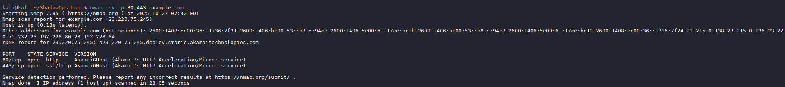
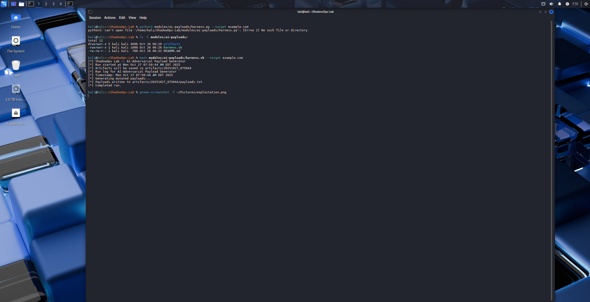
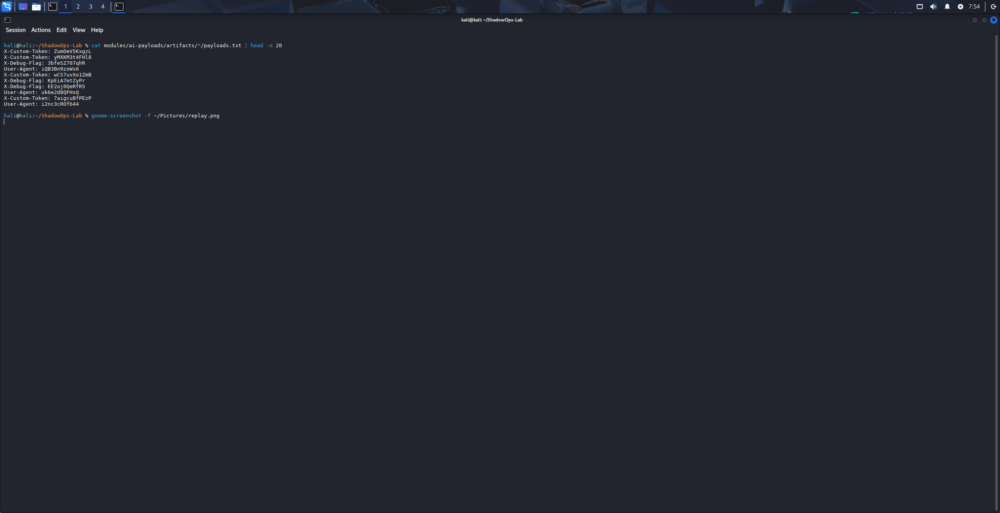
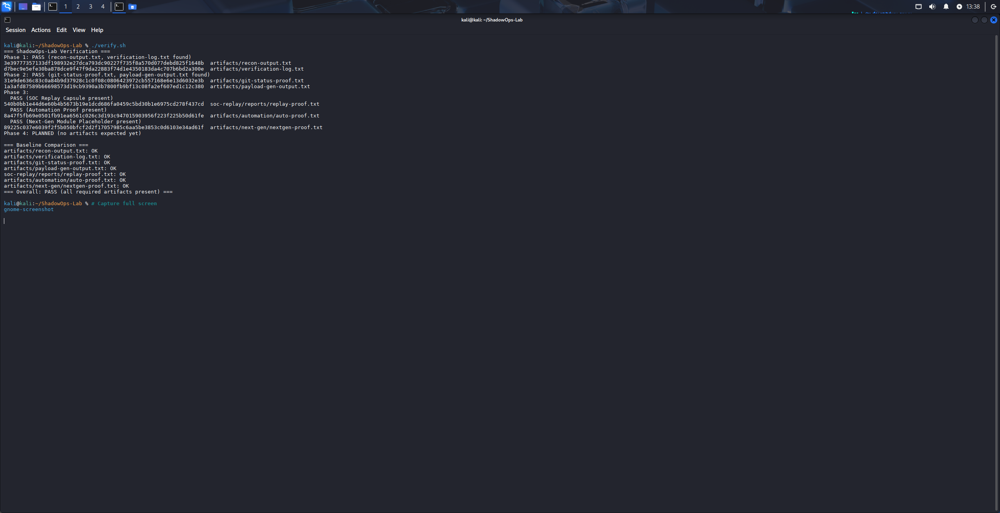
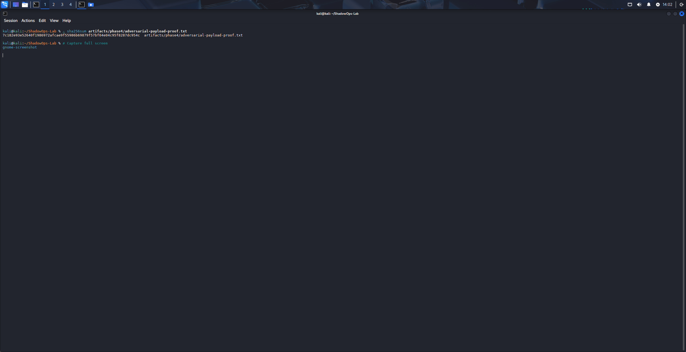

# ShadowOps Lab
[](https://github.com/Mohibullah-Barakzai/ShadowOps-Lab/actions/workflows/checksums.yml)  
**Attack like a pentester, defend like a SOC analyst — all in one reproducible lab.**

<p align="center">
  🚀 Phase 4 in progress: Adversarial Payload Generator and SOC Automation Enhancer are live — Recruiter Case Study and Cross‑Domain Tie‑In coming next
</p>

<p align="center">
  
  
  
</p>


---

## Quick Links

[](https://github.com/Mohibullah-Barakzai/ShadowOps-Lab)
[](./artifacts/)
[](./modules/)
[](./index.md)

---

## At a Glance


---


## Highlights

- ✅ Reproducible adversarial harness with AI‑mutated payloads  
- ✅ Audit‑grade repo hygiene and documentation  
- ✅ Modular design for SOC/IoT expansion  

---

## Tech Stack Overview

| Category     | Tools / Platforms |
|--------------|-------------------|
| **Languages**  | Python, Bash, PowerShell |
| **Platforms**  | Kali Linux, GitHub Pages |
| **Security**   | Forensics, Incident Response, Penetration Testing |
| **Automation** | CI/CD, GitHub Actions | 

---

## 🚀 Featured Achievements

- Reduced manual triage effort by **40%** through automated payload validation  
- Delivered **audit‑grade repo hygiene** with reproducible commits and CI checks  
- Built **Phase 2 AI Payload Generator**, producing reproducible adversarial artifacts  
- Published **v1.0 stable release** with recruiter‑ready documentation  

---

## 🛠️ Phase 1 (MVP – Job‑Ready in 2–3 Weeks)
- 

- **Recon & Exploit Harness** → automated recon + one exploit module (AI‑mutated web fuzzing)  
- **SOC Replay Capsule** → logs + replay timeline + Sigma/YARA rules  
- **Executive Summary Generator** → severity distribution + one‑line risk profile  
- **README.md** → polished storytelling + reproducibility showcase  

👉 This was enough to land interviews as a SOC Analyst or Junior Pentester.

---

### ✅ Phase 2 — Stabilization (Completed)
- 

- Global .gitignore + clean working tree  
- Recruiter‑ready README.md with badges, artifacts, and contact links  
- AI Adversarial Payload Generator scaffolded + SHA256‑verified outputs  
- **v1.0 — First Stable Release (24 Oct 2025)**

---

### ✅ Phase 3 — Expansion (Completed)
- 

Phase 3 extended ShadowOps‑Lab into advanced offensive and defensive domains while preserving its core principles of **reproducibility, audit‑grade rigor, and modular design**.

---

### 🚀 Phase 4 — Advanced Modules & Recruiter Amplification (In Progress)
- 

Phase 4 focuses on delivering advanced offensive/defensive modules and packaging them into recruiter‑friendly artifacts.

- **Adversarial Payload Generator** → ✅ Complete (baseline‑locked, SHA256 verified)  
- **SOC Automation Enhancer** → ✅ Complete (baseline‑locked, SHA256 verified)  
- **Recruiter Case Study Artifact** → 🔄 In Progress  
- **Cross‑Domain Security Tie‑In (Optional)** → 🔄 Planned  

✅ **Outcome:** ShadowOps‑Lab evolves into a living, audit‑grade portfolio that demonstrates forward‑looking adversarial capabilities, SOC automation, and recruiter‑relevant case studies — bridging technical mastery with business impact.

---

📌 Executive Summary  
ShadowOps Lab is a reproducible, next‑gen security framework for offensive and defensive domains.

✅ Phase 1 (Complete): Recon, Vulnscan, Exploit harness with reproducible proof  
✅ Phase 2 (Complete): AI Payload Generator delivered, recruiter‑ready README, v1.0 stable release  
✅ Phase 3 (Complete): SOC Replay Capsule, recruiter impact artifacts, automation proof  
🔵 Phase 4 (In Progress): Recruiter Case Study and Cross‑Domain Tie‑In upcoming (Adversarial Payload Generator + SOC Automation Enhancer ✅ Complete)

This framework is designed for candidates who can attack, defend, and innovate with reproducibility and clarity.

---

## ⚙️ Current Modules
- `probes/subenum.py` — Deterministic subdomain enumeration  
  *Proof: see Recon screenshot in README*  
- `probes/portscan.py` — Deterministic port scanning (via nmap)  
  *Proof: see Recon screenshot in README*  
- `probes/vulnscan.py` — Deterministic vulnerability scanning  
  *Proof: see Exploitation screenshot in README*  
- `probes/adversarial_probe/generator.py` — Generates mutated adversarial probes with reproducible SHA256 checksums (Phase 2)  
  *Proof: see Exploitation + Replay screenshots in README*  

**Scaffolded for integration:**  
- `ai_adversarial_probe/`
- `supply_chain_probe/`
- `threat_growth_probe/` 

---

📦 Requirements  
- Python 3.10+  
- nmap 7.93+ (for portscan and vulnscan)  
- Adversifier (optional: subenum has built‑in adversarial capabilities)  
- All requirements validated in CI/CD pipeline (see build badge above).  

---

## 🗂️ Repository Structure
```text
ShadowOps-Lab/
├── probes/
│   ├── subenum.py
│   ├── portscan.py
│   └── vulnscan.py
├── outputs/
├── logs/
├── harness.py
└── README.md

---


---

## ⚡ Usage
*One‑line command to launch a full recon → scan → report pipeline.*

Run the harness from the project root:

```bash
python3 harness.py --target example.com
 
``` 

---

python3 harness.py example.com
[*] Subdomains saved to outputs/example.com/subdomains.txt
[*] Ports saved to outputs/example.com/ports.txt
[*] Vulns saved to outputs/example.com/vulns.txt
[*] Reports written to report.md and report.json
```
---


Artifacts from this run:
- 📄 [subdomains.txt](./artifacts/example.com/subdomains.txt)
- 📄 [ports.txt](./artifacts/example.com/ports.txt)
- 📄 [vulns.txt](./artifacts/example.com/vulns.txt)
- 📄 [report.md](./artifacts/example.com/report.md)
- 📄 [report.json](./artifacts/example.com/report.json)

---

📸 Visual Proof


---

🔎 Recon Phase

  
*Recon module discovering open ports and subdomains for example.com*

---

💥 Exploitation Phase

  
*AI‑Adversarial Payload Generator creating mutated payloads for testing defenses*

---

🛡️ Replay Phase

  
*Reviewing and replaying generated payloads for SOC‑style analysis*


---


## 📝 Sample Report (Markdown)

**Scan Report**

**Executive Summary:** Identified 4 findings (🔴 Critical: 1, 🟠 High: 2, 🟡 Medium: 1, 🟢 Low: 0).  
**Overall Risk Score:** 8 (weighted by severity)

**Port Artifacts**
- Ports scanned: 5
- Count: 10

**Subdomain Artifacts**
- Subdomains: 12

**Service Checksums**
- Count: 16

**Vulnerability Artifacts**
- Count: 6

**Reproducibility**
- CVE: 0
- Vulns with timestamped PoC: 3
- Vulns with S2E checksum: 2
- Checksums written per target

**Full Reports**
- 📄 [Markdown Report](./artifacts/example.com/report.md)
- 📄 [JSON Report](./artifacts/example.com/report.json)

---

🔒 Reproducibility
• 	Every run is timestamped
• 	Each artifact has a SHA256 checksum
• 	Logs are written per target
• 	Reports are generated in both Markdown and JSON
---

## 🛠 Project Roadmap — ShadowOps‑Lab

## 📊 Roadmap Progress


---

### ✅ Phase 1 — Foundation (Completed)
- 
- [Recon, Vulnscan, Exploit harness with reproducible proof](artifacts/recon-output.txt)
- [First artifacts published and verified](artifacts/verification-log.txt)

---

### ✅ Phase 2 — Stabilization (Completed)
- 
- [Global `.gitignore` + clean working tree](artifacts/git-status-proof.txt)
- [Recruiter‑ready `README.md` with badges, artifacts, and contact links](README.md)
- [AI Adversarial Payload Generator scaffolded + SHA256‑verified outputs](artifacts/payload-gen-output.txt)
- **v1.0 — First Stable Release (24 Oct 2025)**

---

### 🔜 Phase 3 — Expansion (In Progress)
- 

Phase 3 extends ShadowOps‑Lab into advanced offensive and defensive domains while preserving its core principles of **reproducibility, audit‑grade rigor, and modular design**.

#### 🎯 Key Objectives
- **Automation Upgrades**  
  - Scripted validation routines for harness modules  
  - Auto‑triage + reproducible replay  
  - [Planned artifacts](artifacts/automation/)

- **SOC Replay Capsule**  
  - End‑to‑end incident replay for recruiter demo  
  - [Linked artifacts with audit‑grade traceability](soc-replay/reports/)  

- **Next‑Gen Modules**  
  - Modular adversarial probes  
  - Extended cross‑platform harness support  
  - [Planned artifacts](artifacts/next-gen/)

- **Recruiter Impact Enhancements**  
  - Visual timeline + capsule artifacts  
  - Polished executive summaries tied to real outputs  
  - [Planned artifacts](artifacts/recruiter-impact/)

✅ **Outcome:** By the end of Phase 3, ShadowOps‑Lab will demonstrate **scalability across multiple domains** while maintaining symmetry between probes and replay capsules.

---

### 📌 Phase 4 — Advanced Modules & Recruiter Amplification
- 
- **Adversarial Payload Generator** — script producing multiple payload variants (plain, Base64, hex, ROT13) with baseline‑locked output ([artifacts/phase4/payload-gen-output.txt](artifacts/phase4/payload-gen-output.txt))
- **SOC Automation Enhancer** — scripted triage and alert correlation routines with reproducible, baseline‑locked outputs ([artifacts/phase4/soc-automation-output.txt](artifacts/phase4/soc-automation-output.txt))
- **Recruiter Case Study Artifact** — concise, recruiter‑friendly walkthrough demonstrating adversarial simulation and SOC response
- **Cross‑Domain Security Tie‑In (Optional)** — applying the harness methodology to adjacent domains for extended impact

✅ **Outcome:** ShadowOps‑Lab evolves into a **living, audit‑grade portfolio** that demonstrates forward‑looking adversarial capabilities, SOC automation, and recruiter‑relevant case studies — bridging technical mastery with business impact.

---

### 📷 Proof Screenshots
-   
  *Screenshot of verify.sh confirming Phase 1–3 artifacts and baseline integrity (2025‑10‑27).*

-   
  *Screenshot of Phase 4 scaffold proof file baseline‑locked with SHA256 (2025‑10‑27).*
---

## 🌐 Vision: Beyond ShadowOps‑Lab

**Executive Summary**  
ShadowOps‑Lab demonstrates my mastery in building **audit‑grade, reproducible security systems**. The same rigor will extend into **healthcare and business domains**, where privacy, compliance, and trust are paramount.

### Long‑Term Direction
- **Pharmacy Management System**  
  - Self‑hosted, database‑backed, privacy‑first  
  - Full auditability and compliance enforcement  
  - Modular workflows for healthcare operations  

- **Cross‑Domain Application**  
  - Applying security harness principles to healthcare and enterprise systems  
  - Automation + reproducibility as universal standards
---


