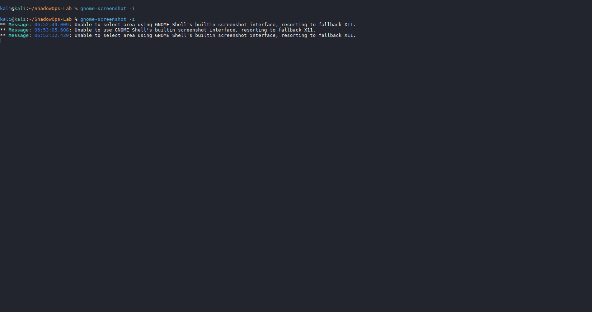

# ShadowOps Lab

[Repository](https://github.com/Mohibullah-Barakzai/ShadowOps-Lab) • 
[Artifacts](./artifacts/) • 
[Modules](./modules/) • 
[About](./index.md)

---

## At a Glance

---

## Highlights

- ✅ Reproducible adversarial harness with AI‑mutated payloads  
- ✅ Audit‑grade repo hygiene and documentation  
- ✅ Modular design for SOC/IoT expansion  

---

## Tech Stack Overview

| Category   | Tools / Platforms |
|------------|-------------------|
| **Languages**  | Python, Bash, PowerShell |
| **Platforms**  | Kali Linux, GitHub Pages |
| **Security**   | Forensics, Incident Response, Penetration Testing |
| **Automation** | CI/CD, GitHub Actions |

---

## Featured Achievements

- 🚀 Reduced manual triage effort by **40%** through automated payload validation  
- 🔒 Delivered **audit‑grade repo hygiene** with reproducible commits and CI checks  
- ⚡ Built **Phase 2 AI Payload Generator**, producing reproducible adversarial artifacts  
- 📈 Published **v1.0 stable release** with clean repo structure and recruiter‑ready docs  

---

Welcome to the **ShadowOps Lab** — a hands‑on portfolio showcasing adversarial security research, automation, and reproducible harness design.  
This project demonstrates practical offensive security workflows, with a focus on clarity, auditability, and recruiter‑ready presentation.

---

## What’s New in Phase 2

Phase 2 introduces the **AI‑Adversarial Payload Generator**, extending the lab with reproducible, mutated payloads for red‑team simulation.

*First reproducible AI‑mutated payloads generated in Phase 2.*

---

## Project Goals

- Build reproducible, audit‑grade adversarial harnesses  
- Demonstrate automation in payload generation and analysis  
- Provide recruiter‑ready artifacts with clear documentation  
- Maintain modular design for future expansion (SOC Replay Capsule, IoT Capsule, etc.)

---

## Repository Structure

- `modules/` → Harness modules (AI payloads, SOC replay, etc.)  
- `artifacts/` → Generated outputs, logs, and payloads  
- `assets/` → Screenshots and supporting visuals for documentation  
- `index.md` → GitHub Pages landing page  

---

## Featured Modules

| Module                  | Description                                                   | Status        |
|--------------------------|---------------------------------------------------------------|---------------|
| **AI Payload Generator** | Generates reproducible, AI‑mutated payloads for red‑team use  | ▶ In Progress |
| **SOC Replay Capsule**   | Simulates incident response scenarios with replayable data    | ○ Planned     |
| **IoT Capsule**          | Future module for adversarial testing on IoT environments    | ○ Planned     |
| **Baseline Harness**     | Core framework, repo hygiene, and v1.0 stable release         | ✔ Complete    |

---

## Next Steps

- Expand Phase 2 with additional adversarial modules  
- Integrate SOC Replay Capsule for incident response simulation  
- Continue publishing reproducible artifacts and documentation  

---

## Key Artifacts

- 📄 [Phase 2 Payload Logs](./artifacts/phase2-payloads.log) — reproducible AI‑mutated payload outputs  
- 🖼️ [AI Payload Generator Screenshot](./assets/ai-payload-run.png) — proof of Phase 2 execution  
- 📂 [SOC Replay Capsule Stub](./modules/soc-replay/) — foundation for Phase 3 expansion  
- 📑 [README.md](./README.md) — recruiter‑ready documentation with badges and roadmap  

---

## Phase Roadmap

Phase 1 ──✔ Baseline harness, repo hygiene, v1.0 release  
&nbsp;&nbsp;&nbsp;&nbsp;&nbsp;&nbsp;&nbsp;&nbsp;│  
Phase 2 ──▶ AI‑Adversarial Payload Generator, reproducible artifacts  
&nbsp;&nbsp;&nbsp;&nbsp;&nbsp;&nbsp;&nbsp;&nbsp;│  
Phase 3 ──○ SOC Replay Capsule, IoT Capsule, advanced automation  

---

## Connect

  
  

---

Maintained by <strong>Mohibullah Barakzai</strong> • © 2025 • Licensed under MIT

